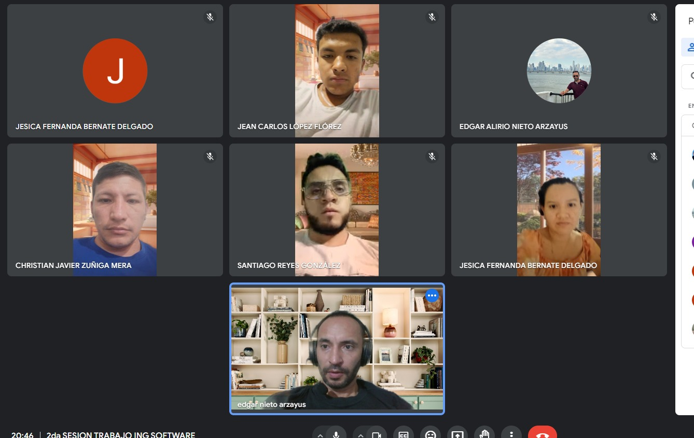
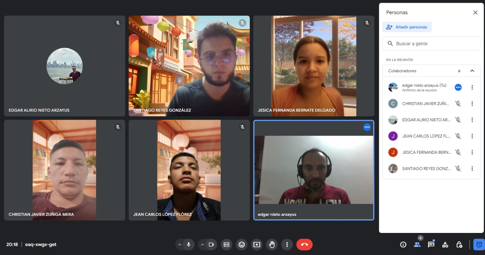
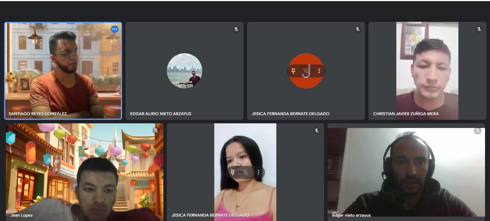

# Equipo Desarrollo de Viuri
- Edgar Nieto - Scrum Master
- ✨Jesica Fernanda Bernate Delgado✨ -Desarrollador
- Christian Javier Zuñiga Mera - Desarrollador
- Jean Carlos Lopez Florez - Desarrollador
- Santiago Reyes - Desarrollador 

# Viuri
{:width="100px" height="100px"}
## _Empresa especializada en la venta de productos de belleza femenina, Online_

### Repositorio en GitHub:
El código fuente de nuestro proyecto está disponible en nuestro repositorio de [GitHub](https://github.com/SantiagoReyesGonzalez/viuri).

## Enlaces a Tableros de Trello por Sprint:

### Sprint 1:
- [Tablero de Trello](https://trello.com/b/O6SDGT0C/sprint-1)

### Sprint 2:
- [Tablero de Trello](https://trello.com/b/2OdU8BfL/sprint-2)

### Sprint 3:
- [Tablero de Trello](https://trello.com/b/b4uDtDRM/sprint-3)

### Sprint 4:
- [Tablero de Trello](https://trello.com/b/nqk4Jfum/sprint-4)

## Capturas de los Daily:

### Daily del 19 de abril de 2024:

### Daily del 26 de abril de 2024:

### Daily del 17 de mayo de 2024:
